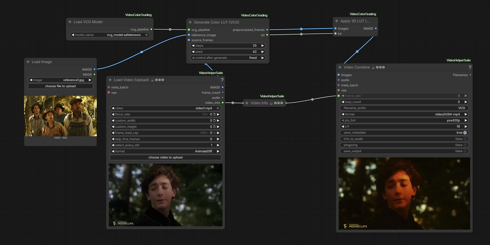

# ComfyUI-VideoColorGrading

ComfyUI implementation of [Video Color Grading via Look-Up Table Generation](https://github.com/seunghyuns98/VideoColorGrading) (ICCV 2025).

Generates a 3D color LUT from a reference image and source video frames using a two-stage diffusion process, then applies it for consistent color grading.

## Nodes

- **Load VCG Model** - Loads the combined model checkpoint (CLIP ViT-B/32, VAE, ReferenceNet, L-Diffuser)
- **Generate Color LUT (VCG)** - Generates a 16^3 3D LUT from reference image + source frames
- **Apply 3D LUT (VCG)** - Applies the generated LUT to images

## Setup

Model:

https://huggingface.co/Kijai/VCG_comfy/tree/main/checkpoints

## Links

- Paper: https://arxiv.org/abs/2508.00548
- Original code: https://github.com/seunghyuns98/VideoColorGrading
